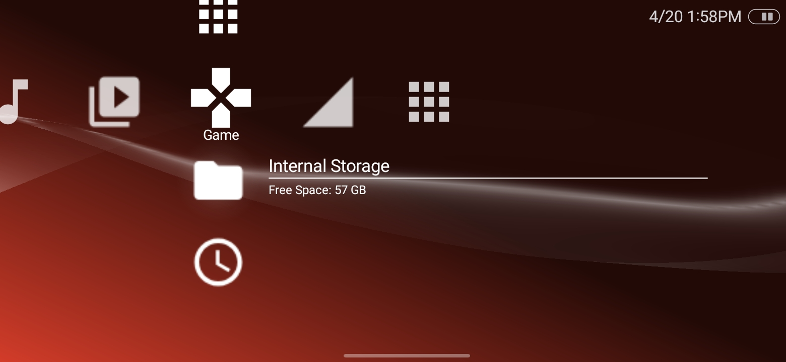
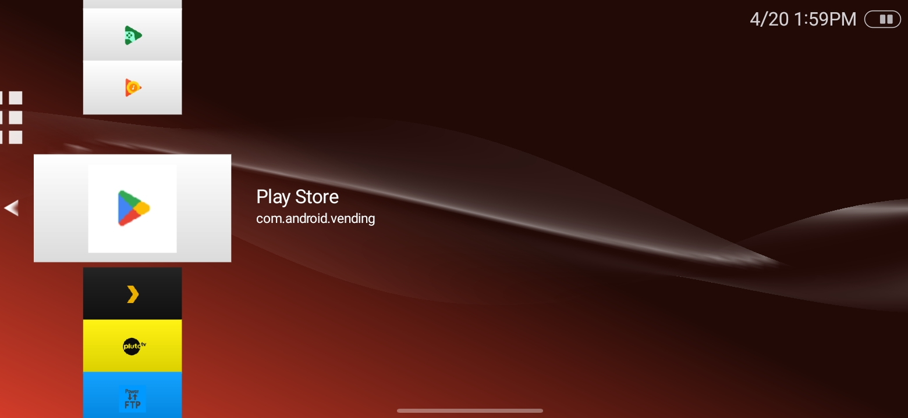

# CrossLauncher Revival

Unofficial continuation of CrossLauncher for controller-first Android devices.

CrossLauncher Revival is built for:

- Android handhelds
- controller-first Android devices
- Android TV and box-style setups
- devices where d-pad, gamepad, or keyboard navigation matters more than touch-first phone UX

This project is not trying to be a generic phone homescreen.

## Screenshots




## Install / Download

- GitHub prerelease builds are published on the [Releases](https://github.com/sexcurrybeats/CrossLauncher-Revival/releases) page when available
- If you want to build it yourself, see [Build from source](#build-from-source)
- This launcher is meant to replace the default home app on controller-first devices, not to sit on top of a touch-first phone workflow

## Tested on

- Retroid Pocket 5
- OnePlus Nord N30 with GameSir G8

Most testing so far has been on my RP5.

## Who this is for

This launcher is for:

- Android handhelds
- controller, d-pad, and keyboard-first setups
- Android TV and box-style devices
- people who want a shell-style UI instead of a standard phone launcher

This launcher is not for:

- touch-first phone use
- people expecting a polished stock-Android replacement
- people who need every service integration fully finished already

## What works well

- shell-style category and content navigation
- handheld layout defaults
- browser and camera node behavior
- bucket/folder-first Photo browsing
- shell-level customization through XTF
- signed prerelease build support

## Known issues

- some platform integrations are still early
- some optional service nodes remain placeholders until configured
- Music and Video are not as polished as Photo yet
- broader TV-focused shell work is planned later
- device testing coverage is still narrow

## Current focus

The current release line is centered on:

- stable handheld-first shell behavior
- a cleaner default experience
- practical controller-first navigation
- optional XTF-based customization
- incremental Android integration work on top of the shell

## XTF customization

XTF is the launcher's portable customization format.

Current XTF support includes:

- launcher preferences
- wave preferences
- shell icon overrides
- menu sounds
- coldboot and gameboot media
- HUD battery glyph overrides
- theme/font references and related shell-state data

New XTF exports are focused on shell-level customization. They do not export per-app or per-game icon/backdrop media.

### Supported theme assets

- shell/static icons use image formats such as `png`, `webp`, `jpg`, and `jpeg`
- animated icons use `gif`, `webp`, or `apng`
- animated icons should stay at or under `4 MB`
- menu sound overrides use `ogg`, `wav`, or `mp3`
- coldboot images use normal image formats and coldboot audio is imported as standard audio
- gameboot supports static or animated visual media plus standard audio imports
- battery glyph overrides use normal image formats

Common internal asset names you will see in exported/imported theme content:

- `ICON0`: static icon
- `ICON1`: animated icon
- `PIC1`: backdrop
- `PIC0`: overlay
- `SND0`: back sound

For deeper notes on XTF behavior and compatibility, see [XTF compatibility](./XTF_COMPATIBILITY.md).

### Making and sharing a theme

If you want to make a theme pack for other people to use:

- set your shell up the way you want from Settings
- customize the shell icons, menu sounds, wave settings, coldboot, gameboot, and other shell-level options you want included
- export an XTF package from the launcher
- share that `.xtf` file with other CrossLauncher users so they can import it on compatible builds

That makes XTF the normal way to move a shell setup between devices or share a theme with other users.

See:

- [XTF compatibility](./XTF_COMPATIBILITY.md)
- [Theme / asset pack notes](./RELEASE_ASSET_PACKS.md)
- [Asset audit](./ASSET_AUDIT.md)

## Releases

Current prerelease notes:

- [v0.12.0-alpha4 release notes](./RELEASE_NOTES_0.12.0-alpha4.md)

Issue reporting guidance:

- [How to report bugs](./ISSUE_REPORTING.md)

## Build from source

If you want to build from source:

- use the Android project in this repo
- JDK 17 is the normal Gradle lane for local builds

Main developer entrypoint:

```powershell
./gradlew.bat :launcher_app:assembleDebug
```

## Upstream credit

This project is an unofficial continuation of the original CrossLauncher project.

The original project was MIT-licensed and explicitly allowed forks and continuations.

## License

The project remains under the upstream MIT license unless a specific file states otherwise.
